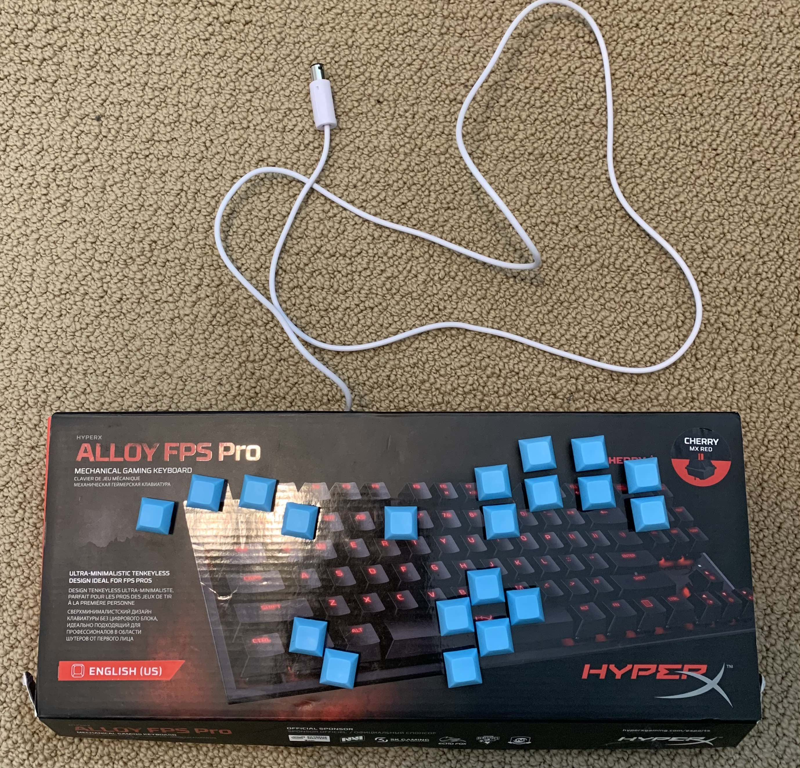
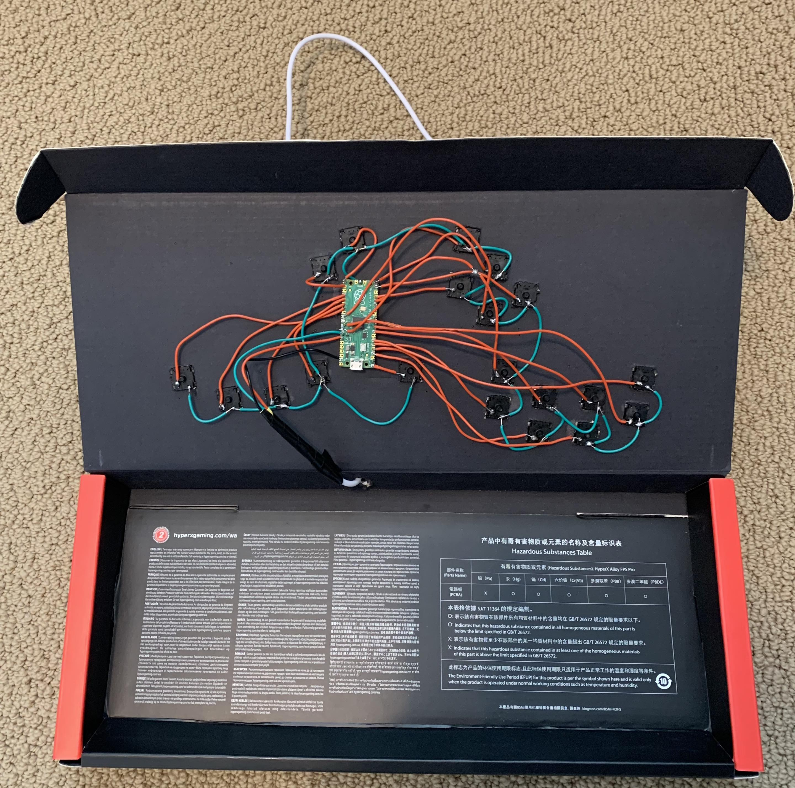

# Cardboard Frame 1

I followed [this tutorial](https://www.youtube.com/watch?v=trGa98tEy_0) in order to build my own frame 1. However, instead of the microcontrollers he talks about in the video, I used a Raspberry Pi Pico. In addition, I decided to salvage the cable from an old 3rd party Gamecube controller and solder this to the board. That way, I can use this controller with an adapter on my computer or just an ordinary Gamecube/Wii setup.

