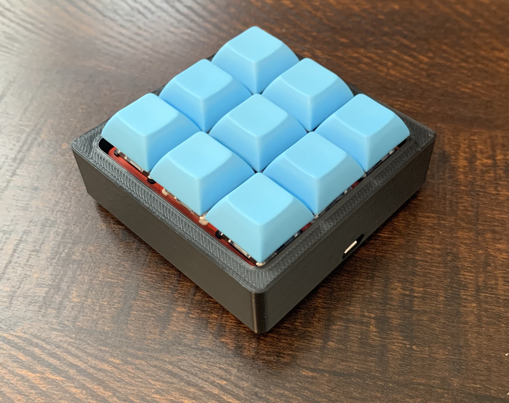
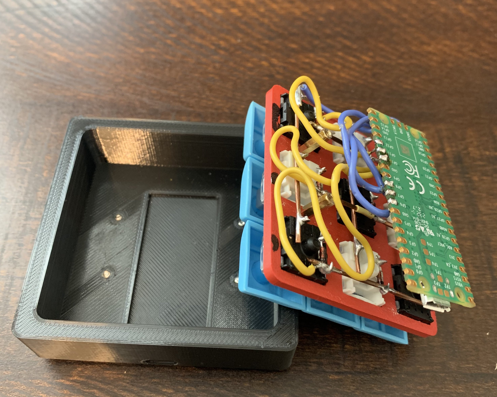

# Dece9

I followed Joe Scotto's [How to Build a Handwired Keyboard](https://youtu.be/hjml-K-pV4E) and [How to Design Mechanical Keyboard Plates and Cases](https://youtu.be/7azQkSu0m_U) tutorials in order to "design", 3D print, hand-wire, and flash custom firmware on my very first from scratch keyboard. I basically used all of his reccomended components, with the exception of using a Raspberry Pi Pico as the microcontroller. It was a bit bigger, so I had to adjust the screw hole placement slightly, but it worked really well. I plan to modify the firmware to be KMK-based instead of QMK-based (following [this](https://youtu.be/Q97bFwjQ_vQ) tutorial). This will give me more flexibility in updating the firmware (Python-based instead of C-based, and I don't need to press the button on the controller to turn it into bootloader mode).

