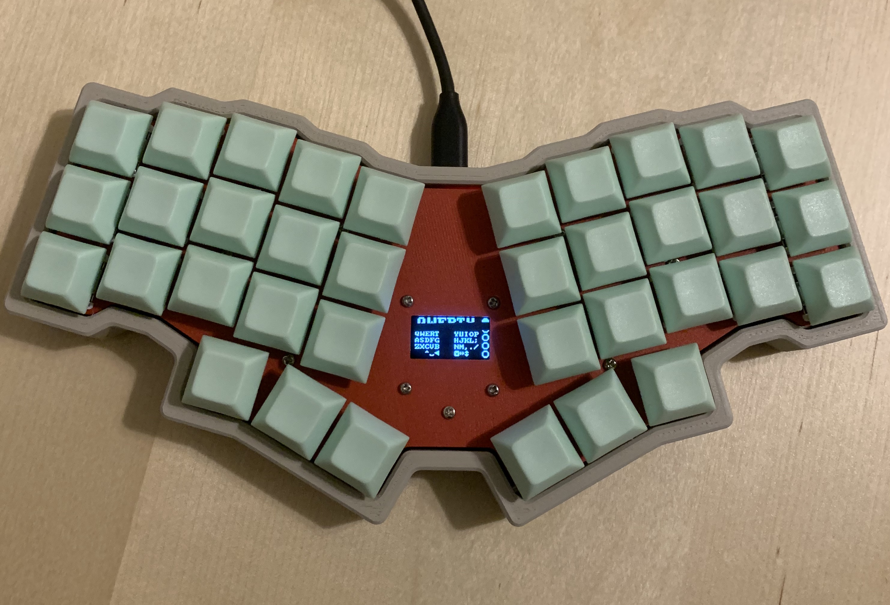
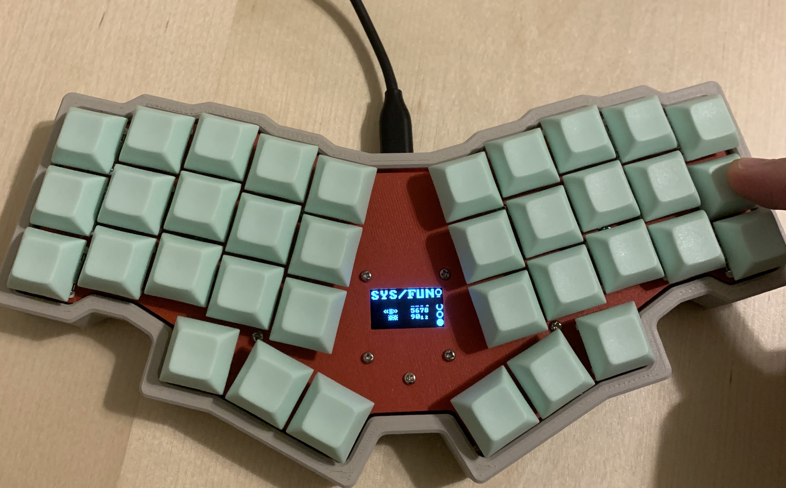
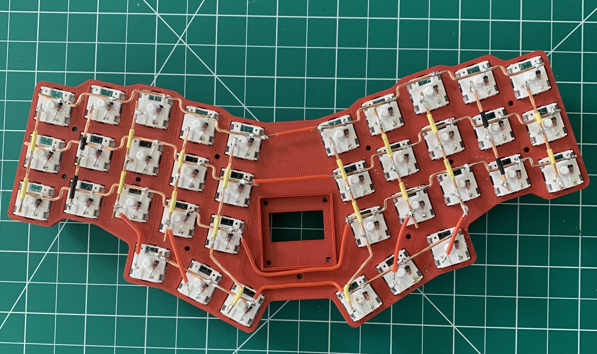
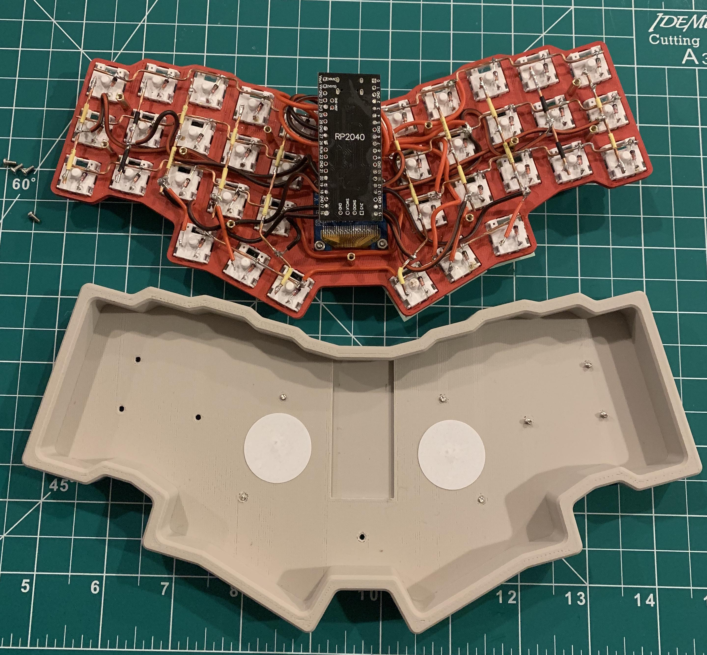

# Julep - My Tiny Training Keyboard

Hot off the heels of creating the [Dece9](/Dece9), I was excited to start my first completely original keyboard project. Thus, Julep was born. (My wife named it Julep after seeing the mint-colored keycaps. See [Julep](https://en.wikipedia.org/wiki/Julep) on wikipedia.)

I decided to make Julep a [tiny keyboard](https://youtu.be/EiHD9T2d6YU) for a few reasons:

1. I figured less wiring would make my life easier
1. I can fit the pieces entirely inside the printbed of my Ender 3 3D printer
1. It would be fun to experiment with using one for the first time.

To make my life easier, I decided to essentially make this a training keybaord by embedding an OLED display into the center of the board. This will allow me to easily glance down and see which layer is active given the various keys that I am holding. In addition, I show ~~all~~ most of the keys that are available to press in the given layer in the proper position on each hand. Because the keybaord is so tiny, I was able to fit all this information onto the one tiny 128x64 Pixel display.

Hardware:

- RP2040 MicroController
- Keychron Brown Mechanical Switches
- DSA Keycaps
- OLED I2C Display Module: [Amazon Link](https://www.amazon.com/gp/product/B09T6SJBV5/ref=ppx_yo_dt_b_search_asin_title?ie=UTF8&psc=1)

Relevant Case Links:

- Keyboard layout created using [Keyboard Layout Editor](http://www.keyboard-layout-editor.com/) - [Github Gist Link](https://gist.github.com/macdude95/b101f8fd284c11fa0c9b599e10f0f7b4)
- Onshape project where I modeled the case/frame - [Onshape Link](https://cad.onshape.com/documents/dd3294096a0ce4cbe178fbe8/w/1a3f36e883e79902f0e52601/e/cb3c0aa86e72135d4f1f1b8b?renderMode=0&uiState=642cf7384a1728777d2dbb1e)

Here is the final product! I promise the OLED screen looks much better not on camera. The refresh line kinda screwed up the photo.

Here is an example of one of the layers I configured. You can see the OLED screen updated automatically and showed the available keys on that layer. The circles on the right side also updating indicating which layer I am on.

