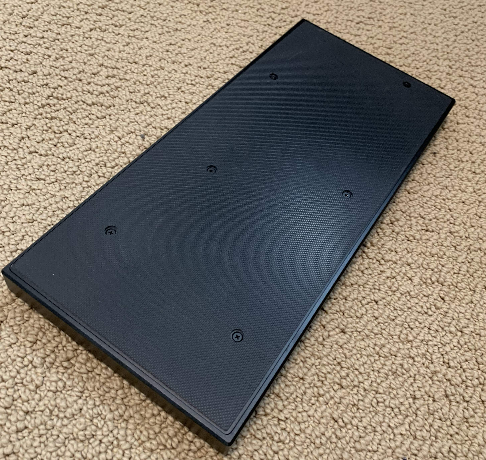

# Open Frame 1

I was so excited when Greg Turbo made [the announcement](https://youtu.be/RbpOA7Az5DE) that Frame1 controllers were becoming open-source. The designs were being released, and some old chassis were being sold at [frame1.gg](https://frame1.gg/). In addition, an experienced DIY smash-box creator and tutorial maker, Crane, released [this video](https://youtu.be/w4r5CNIimU0) explaining exactly how to use these designs to make your own Open Frame 1. I bought a chassis, placed an order for PCBs using the released schematics, found and printed [some keycap 3D models that I liked](./Keycaps/), bought the reccomended switches, bout some hotswap sockets, bought some Raspberry Pi Picos, soldered everything together, and I was done!

Super easy and satisfying build. The solid aluminum chassis makes this thing feel so high quality sitting in my lap. This has become my primary controller for playing Super Smash Brothers Melee, and I don't think I will even completely go back to GameCube. Thank you so much Greg Turbo and Crane!

OpenFrame1 project on GitHub: https://github.com/GregTurbo/Open-Frame1

Keycaps project on GitHub by Sylvatica: https://github.com/rana-sylvatica/circle-keycaps

